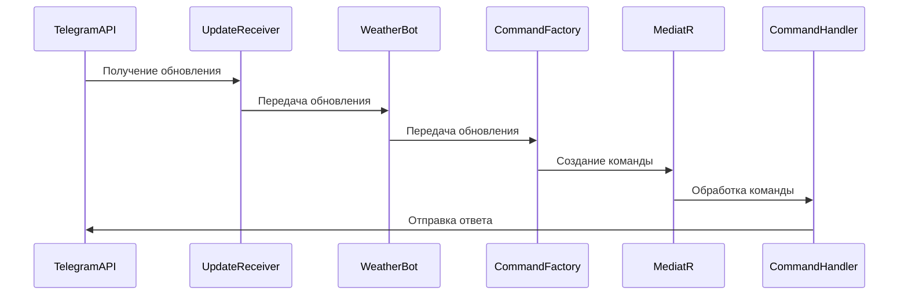

# Разработка бота для Telegram на платформе .NET

## Введение
[Telegram](https://telegram.org/) — один из самых популярных мессенджеров в мире, предлагающий такие функции, как групповые чаты, каналы, голосовые и видеозвонки, а также возможность создания ботов.

В данной статье мы не будем ставить цель показать, как создать бота типа "Hello, World!" с нуля, а рассмотрим более сложный пример готовой реализации бота на платформе .NET с использованием современных технологий и практик разработки.

## Выбор библиотеки для создания бота
Существует несколько способов создания Telegram-ботов на платформе .NET, включая использование сторонних библиотек и фреймворков. Рассмотрим самые популярные варианты, [предлагаемые самим Telegram](https://core.telegram.org/bots/samples#net).

#### [Telegram.Bot](https://github.com/TelegramBots/Telegram.Bot) от TelegramBots
- Наиболее популярная библиотека для создания Telegram-ботов на платформе .NET.
- Поддерживает все возможности Telegram Bot API.
- Регулярно обновляется и поддерживается сообществом.
- Обладает подробной документацией и примерами использования.
- Поддерживает .NET Standard 2.0 и .NET 6+.

#### [Telegram.BotAPI](https://github.com/Eptagone/Telegram.BotAPI) от Eptagone
- Еще одна популярная библиотека для создания Telegram-ботов на платформе .NET.
- Также поддерживает все возможности Telegram Bot API, регулярно обновляется и имеет хорошие примеры использования.
- Поддерживает .NET Standard 2.0, .NET Framework 4.6.2+ и .NET 6, 8.

#### [TelegramBotFramework](https://github.com/MajMcCloud/TelegramBotFramework) от MajMcCloud
- Библиотека с простым интерфейсом для создания ботов, напоминающая разработку приложений на Windows Forms.
- Имеет хорошую документацию и примеры использования.
- Обновляется реже, чем Telegram.Bot и Telegram.BotAPI, и не поддерживает все возможности Telegram Bot API.
- Поддерживает .NET Standard 2.0+ и .NET 6, 7.

Для примера реализации была выбрана библиотека [Telegram.BotAPI](https://github.com/Eptagone/Telegram.BotAPI), так как она обладает актуальными возможностями и предоставляет лучшие примеры использования. Данный выбор — субъективный и не является строгой рекомендацией, так как обе библиотеки одинаково хороши.

## Практический пример реализации
Рассмотрим [GitHub-репозиторий](https://github.com/alex1ozr/TelegramBot) с примером реализации.

### Основные особенности рассматриваемой реализации
- Технические:
    - Современная версия платформы [.NET 8](https://learn.microsoft.com/en-us/dotnet/core/sdk).
    - [.NET Aspire](https://learn.microsoft.com/en-us/dotnet/aspire/get-started/aspire-overview) для развёртывания проекта и управления зависимостями.
    - [PostgreSQL](https://www.postgresql.org) для хранения и [Entity Framework Core 8](https://learn.microsoft.com/en-us/ef/core/what-is-new/ef-core-8.0/whatsnew) для работы с данными.
    - [MediatR](https://github.com/jbogard/MediatR) для реализации [паттерна CQS](https://en.wikipedia.org/wiki/Command–query_separation) и уменьшения связанности.
    - [OpenTelemetry](https://opentelemetry.io) для логирования, трассировки и мониторинга.
- Функциональные:
    - Получение обновлений через Polling (Webhook не рассматривается для простоты).
    - Поддержка пожертвований в виде [Telegram Stars](https://telegram.org/blog/telegram-stars).
    - Ролевая система для управления доступом к командам.
    - Поддержка пользовательских настроек.
    - Локализация интерфейса и сообщений.
    - Inline-функции для быстрого доступа к информации.

### Архитектура решения

#### Общая структура
Решение разделено на несколько слоев, каждый из которых отвечает за свою функциональность:

1. **Host**/**AppHost** - слой, отвечающий за запуск приложения.
   - Содержит точку входа и конфигурацию всех необходимых сервисов, таких как MediatR, Entity Framework и OpenTelemetry.
   - Кроме того, он настраивает подключение к базе данных и инициализирует бота.
   - AppHost также позволяет запустить приложение и все зависимости с помощью .NET Aspire.
2. **Application** - слой, содержащий бизнес-логику приложения.
   - Здесь находятся обработчики команд, которые обрабатывают запросы пользователей и выполняют соответствующие действия.
   - В этом слое также реализованы паттерны CQS и Mediator для разделения команд и запросов.
Все команды и их обработчики сгруппированы в отдельные директории по функциональности, что упрощает их поиск и поддержку и несколько напоминает подход [Feature sliced](https://feature-sliced.design).
```
src
├── Application
│   ├── Features
│   │   ├── Bot
│   │   │   ├── StartBotCommand.cs
│   │   │   ├── StartBotCommandHandler.cs
...
│   │   ├── Weather
│   │   │   ├── WeatherBotCommand.cs
│   │   │   ├── WeatherBotCommandHandler.cs
```
3. **Data** - слой, отвечающий за доступ к данным и взаимодействие с базой данных.
   - Здесь реализованы репозитории, использующие Entity Framework для выполнения операций с базой данных.
   - Также в этом слое находятся миграции базы данных и конфигурации сущностей.
4. **Domain** - слой, содержащий основные сущности и интерфейсы, используемые в приложении.
   - Здесь определены модели данных, интерфейсы репозиториев и другие абстракции, которые помогают отделить бизнес-логику от деталей реализации.
5. **Framework** - вспомогательные библиотеки и утилиты, используемые в проекте.
   - Это могут быть общие классы, расширения, обработчики исключений и другие компоненты, которые помогают упростить разработку и поддержку приложения.

#### Взаимодействие компонентов
1. **Запуск приложения**: Проект `Host` инициализирует все необходимые сервисы и запускает приложение.
2. **Обработка команд**: Когда пользователь отправляет команду боту, она попадает в слой `Application`, где соответствующий обработчик команды выполняет бизнес-логику.
3. **Доступ к данным**: Если обработчику команды необходимо взаимодействовать с базой данных, он использует репозитории из слоя `Data`.
4. **Использование сущностей**: Репозитории и обработчики команд работают с сущностями и интерфейсами из слоя `Domain`.
5. **Вспомогательные функции**: В процессе работы приложения используются утилиты и библиотеки из слоя `Framework`.

Данная архитектура позволяет легко масштабировать и поддерживать приложение, разделяя ответственность между различными слоями и обеспечивая гибкость и модульность кода.

### Инфраструктура бота

#### Конфигурирование
Для полноценной работы бота необходимо настроить токен API Telegram (получение самого токена опустим, т.к. данная тема хорошо раскрыта в [официальной документации](https://core.telegram.org/bots/tutorial)) и список основных команд.
Этой цели служит класс [TelegramBotSetup](https://github.com/alex1ozr/TelegramBot/blob/main/src/Application/Infrastructure/HostedServices/TelegramBotSetup.cs), исполняемый как hosted-сервис при запуске приложения.

Для каждого поддерживаемого языка определяются команды, которые будут отображаться в списке доступных команд бота непосредственно в приложении Telegram.
```csharp
internal sealed class TelegramBotSetup : IHostedService
{
    // ctor

    public async Task StartAsync(CancellationToken cancellationToken)
    {
        //...
        await SetCommands(cancellationToken).ConfigureAwait(false);
        //...
    }

    private async Task SetCommands(CancellationToken cancellationToken)
    {
        await _client.DeleteMyCommandsAsync(cancellationToken: cancellationToken).ConfigureAwait(false);

        // default (en)
        await _client.SetMyCommandsAsync(
            [
                new(WeatherBotCommand.CommandName,
                    _botMessageLocalizer.GetLocalizedString(nameof(BotMessages.WeatherCommandDescription), BotLanguage.English)),
                new(HelpBotCommand.CommandName,
                    _botMessageLocalizer.GetLocalizedString(nameof(BotMessages.HelpCommandDescription), BotLanguage.English)),
            ],
            cancellationToken: cancellationToken).ConfigureAwait(false);

        // other languages
    }
}
```

#### Получение обновлений от Telegram
Для получения обновлений от Telegram используется подход Polling, который позволяет боту регулярно проверять наличие новых сообщений и обновлений.
Такой подход удобен для небольших проектов и не требует настройки веб-хуков. Тем не менее, реализовать полноценный веб-хук тоже не составит труда (см [пример](https://github.com/Eptagone/ShopBot)).

За получение обновлений от Telegram отвечает hosted-сервис [UpdateReceiver](https://github.com/alex1ozr/TelegramBot/blob/main/src/Application/Infrastructure/HostedServices/UpdateReceiver.cs),
который регулярно запрашивает обновления через API Telegram, инициализирует экземпляр класса [WeatherBot](https://github.com/alex1ozr/TelegramBot/blob/main/src/Application/Infrastructure/Bot/WeatherBot.cs) и передает ему полученные данные.

#### Обработка запросов
Центральной точкой функционирования бота является класс [WeatherBot](https://github.com/alex1ozr/TelegramBot/blob/main/src/Application/Infrastructure/Bot/WeatherBot.cs), наследующий библиотечный класс [SimpleTelegramBotBase](https://github.com/Eptagone/Telegram.BotAPI/blob/main/src/library/Telegram.BotAPI.Extensions/SimpleTelegramBotBase.cs).

Именно он отвечает за обработку команд, callback'ов и биллинга.
Для простоты восприятия, данный класс разбит на несколько частей, каждая из которых отвечает за определенный функционал:
- Преобразование обновления или callback'а из Telegram в команду и её отправка в MediatR
- Обработка ошибок
- Обработка платежей
- т.д.

### Обработка команд
Основная задача бота - это обработка сообщений/команд, которые пользователи отправляют боту для выполнения определенных действий.
В рассматриваемом примере команды обрабатываются с использованием паттерна CQS и MediatR.

- Каждая команда Telegram или её callback имеют соответствующий класс, реализующий интерфейс
[IBotCommand](https://github.com/alex1ozr/TelegramBot/blob/main/src/Application/Infrastructure/Bot/Commands/IBotCommand.cs) или [ICallbackCommand](https://github.com/alex1ozr/TelegramBot/blob/main/src/Application/Infrastructure/Bot/Commands/ICallbackCommand.cs).
Например, [StartBotCommand](https://github.com/alex1ozr/TelegramBot/blob/main/src/Application/Features/Bot/StartBotCommand.cs):
```csharp
public sealed record StartBotCommand(Message Message, UserInfo UserInfo) : IBotCommand
{
    public static string CommandName => "start";
}

public interface IBotCommand : IRequest<Unit>
{
    static abstract string CommandName { get; }

    static virtual bool AllowGroups => true;

    static virtual IReadOnlyList<string> Roles { get; } = Array.Empty<string>();

    public Message Message { get; init; }

    public UserInfo UserInfo { get; init; }
}
```
- Имя команды определяется статическим свойством `CommandName`.
  - Соответствие имени и самой команды [автоматически кешируется приложением](https://github.com/alex1ozr/TelegramBot/blob/main/src/Application/Infrastructure/Bot/Commands/BotCommandFactory.cs) для обеспечения быстрой инициализации команд.
  - Дополнительно можно переопределить свойства `AllowGroups` и `Roles` для управления доступом к команде в разрезе групповых чатов и ролей пользователей.
- Обработка команды происходит в соответствующем MediatR-обработчике, который выполняет некоторые вычисления и отправляет готовый результат пользователю.
Например, [StartBotCommandHandler](https://github.com/alex1ozr/TelegramBot/blob/main/src/Application/Features/Bot/StartBotCommandHandler.cs):
```csharp
internal sealed class StartBotCommandHandler : IRequestHandler<StartBotCommand, Unit>
{
    private readonly ITelegramBotClient _telegramBotClient;
    private readonly IBotMessageLocalizer _botMessageLocalizer;

    public StartBotCommandHandler(
        ITelegramBotClient telegramBotClient,
        IBotMessageLocalizer botMessageLocalizer)
    {
        _telegramBotClient = telegramBotClient;
        _botMessageLocalizer = botMessageLocalizer;
    }

    public async Task<Unit> Handle(StartBotCommand request, CancellationToken cancellationToken)
    {
        var message = request.Message;
        var text = _botMessageLocalizer.GetLocalizedString(nameof(BotMessages.HelpCommand), request.UserInfo.Language);

        await _telegramBotClient.SendMessageAsync(
                message.Chat.Id,
                text,
                parseMode: FormatStyles.HTML,
                linkPreviewOptions: DefaultLinkPreviewOptions.Value,
                cancellationToken: cancellationToken)
            .ConfigureAwait(false);

        return Unit.Value;
    }
}
```
Также можно заметить, что в обработчике реализована поддержка локализации сообщений, что позволяет отправлять сообщения на разных языках в зависимости от настроек пользователя.
Информация о пользователе, его языковых предпочтениях и ролях также является частью команды - эти данные заполняются автоматически при создании экземпляра класса.

Опустим в данной статье ролевую систему и вопрос локализации, так как это не является ключевым аспектом рассматриваемого примера. При желании, вы можете изучить соответствующие классы и интерфейсы в репозитории.

#### Диаграмма последовательности обработки команд


## Заключение
Мы рассмотрели создание Telegram-бота на платформе .NET с использованием стека современных библиотек и технологий.
Пример реализации демонстрирует архитектурные подходы, обеспечивающие модульность, гибкость и расширяемость решения.
Это позволяет разработчикам сосредоточиться на бизнес-логике и легко добавлять новые команды и функции, минимизируя связанные изменения кода.

Если у вас есть вопросы или предложения по улучшению решения, не стесняйтесь обращаться к [автору](alex_ozr@yahoo.com) или создавать issue в репозитории.

## Дополнительные материалы

- [Официальная документация Telegram Bot API](https://core.telegram.org/bots)
- [GitHub-репозиторий](https://github.com/alex1ozr/TelegramBot) с примером реализации.
